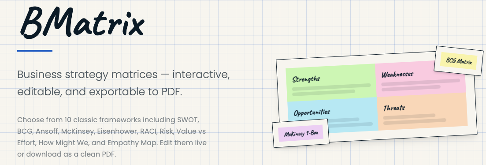

# BMatrix

10 interactive business strategy matrices — editable, bilingual, and exportable to PDF.

## Features

- **10 Frameworks**: SWOT/FODA, BCG, Ansoff, McKinsey, Eisenhower, RACI, Risk, Value vs Effort, How Might We, Empathy Map
- **Bento Grid Layout**: Randomized card arrangements that change on each visit
- **Paper & Highlighter Design**: Hand-drawn borders, grid paper background, highlighter colors
- **Bilingual**: Spanish (default) and English with live switching
- **PDF Export**: Download any matrix as a clean PDF
- **Editable**: Inline editing with lock/unlock toggle
- **Responsive**: Works on mobile, tablet, and desktop

## Tech Stack

- React + TypeScript
- Vite
- Tailwind CSS
- html-to-image (PDF export)
- Vitest + React Testing Library (unit tests)
- Playwright (E2E tests)

## Getting Started

```bash
npm install
npm run dev
```

Open [http://localhost:5173](http://localhost:5173) in your browser.

## Scripts

| Command | Description |
|---------|-------------|
| `npm run dev` | Start development server |
| `npm run build` | Production build |
| `npm run preview` | Preview production build |
| `npm run test` | Run unit tests |
| `npm run test:watch` | Run unit tests in watch mode |
| `npm run test:e2e` | Run E2E tests with Playwright |

## Project Structure

```
bmatrix/
├── src/
│   ├── components/
│   │   ├── matrices/       # Matrix components (SWOT, BCG, etc.)
│   │   ├── MatrixCard.tsx  # Bento grid card component
│   │   ├── LanguageToggle.tsx
│   │   └── PdfDownloadButton.tsx
│   ├── pages/
│   │   ├── Home.tsx        # Landing page with bento grid
│   │   └── MatrixPage.tsx  # Individual matrix view
│   ├── i18n/               # Translations (ES/EN)
│   ├── data/               # Templates and bento layouts
│   ├── hooks/              # Custom hooks (PDF export)
│   └── types/              # TypeScript interfaces
├── e2e/                    # Playwright E2E tests
└── screenshot.png
```

## License

MIT License - see [LICENSE](LICENSE) for details.
